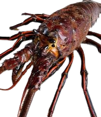

------------------------------------------------------------------------


------------------------------------------------------------------------

### Assignment instructions:

-  Working with partners to troubleshoot code and concepts is encouraged! If you work with a partner, please list their name next to yours at the top of your assignment so Annie and I can easily see who collaborated. 

-  All written responses must be written independently (**in your own words**). 

-  Please follow the question prompts carefully and include only the information each question asks in your submitted responses.

-  Submit both your knitted document and the associated `RMarkdown` or `Quarto` file. 

-  Your knitted presentation should meet the quality you'd submit to research colleagues or feel confident sharing publicly. Refer to the rubric for details about presentation standards.


**Assignment submission (YOUR NAME):** ___Kaiju Morquecho ___

----------------------------------------------------------------------

```{r}

library(tidyverse)
library(here)
library(janitor)
library(estimatr)  
library(performance)
library(jtools)
library(gt)
library(gtsummary)
library(MASS) ## NOTE: The `select()` function is masked. Use: `dplyr::select()` ##
library(interactions) 
library(ggridges)
library(ggrepel)
library(dplyr)

```

------------------------------------------------------------------------

#### DATA SOURCE:

Reed D. 2019. SBC LTER: Reef: Abundance, size and fishing effort for California Spiny Lobster (Panulirus interruptus), ongoing since 2012. Environmental Data Initiative. https://doi.org/10.6073/pasta/a593a675d644fdefb736750b291579a0. Dataset accessed 11/17/2019.

------------------------------------------------------------------------

### **Introduction**

You're about to dive into some deep data collected from five reef sites in Santa Barbara County, all about the abundance of California spiny lobsters! 🦞 Data was gathered by divers annually from 2012 to 2018 across Naples, Mohawk, Isla Vista, Carpinteria, and Arroyo Quemado reefs.

Why lobsters? Well, this sample provides an opportunity to evaluate the impact of Marine Protected Areas (MPAs) established on January 1, 2012 (Reed, 2019). Of these five reefs, Naples, and Isla Vista are MPAs, while the other three are not protected (non-MPAs). Comparing lobster health between these protected and non-protected areas gives us the chance to study how commercial and recreational fishing might impact these ecosystems.

We will consider the MPA sites the `treatment` group and use regression methods to explore whether protecting these reefs really makes a difference compared to non-MPA sites (our control group). In this assignment, we’ll think deeply about which causal inference assumptions hold up under the research design and identify where they fall short. 

Let’s break it down step by step and see what the data reveals! 📊


------------------------------------------------------------------------

Step 1: Anticipating potential sources of selection bias

**a.** Do the control sites (Arroyo Quemado, Carpenteria, and Mohawk) provide a strong counterfactual for our treatment sites (Naples, Isla Vista)? Write a paragraph making a case for why this comparison is centris paribus or whether selection bias is likely (be 
specific!).  

It is unlikely that the comparison between the controls and the treatment sites in this case are centris paribus, at least not perfectly. There are factors at play that we likely have not accounted for. Human factors such as population density inland (near a reef), and environmental factors such as differences in water temperature, food availability, and recent weather events that affect the overall health of the reefs and of its lobsters. Furthermore, we do not know if the conditions within both of the MPAs are themselves centris paribus, nor do we know what the fishing pressures and lobster health conditions were before the reefs were designated as MPAs. These are all factors pointing toward selection bias. 

There are, however, characteristics that make this analysis promising - the 5 reefs geographically relatively close to one another. They likely experience similar ocean currents and temperatures and face similar weather conditions. These are significant in helping mitigate selection bias and make modeling more feasible. 

------------------------------------------------------------------------

Step 2: Read & wrangle data

**a.** Read in the raw data. Name the data.frame (`df`) `rawdata`
```{r}
rawdata <- read_csv(here("data","spiny_abundance_sb_18.csv"),
                         na = "-99999")

sum(is.na(rawdata))
```

**b.** Use the function `clean_names()` from the `janitor` package

```{r}
# HINT: check for coding of missing values (`na = "-99999"`)

rawdata <- clean_names(rawdata)

```

**c.** Create a new `df` named `tidyata`. Using the variable `site` (reef location) create a new variable `reef` as a `factor` and add the following labels in the order listed (i.e., re-order the `levels`): 
    
    "Arroyo Quemado", "Carpenteria", "Mohawk", "Isla Vista",  "Naples"

```{r}

tidydata <- rawdata %>%
  mutate(reef = factor(site,
                       levels = c("AQUE","CARP","MOHK","IVEE","NAPL"),
                       labels = c("Arroyo Quemado","Carpinteria","Mohawk","Isla Vista","Naples")))
    
```

Create new `df` named `spiny_counts` 

**d.** Create a new variable `counts` to allow for an analysis of lobster counts where the unit-level of observation is the total number of observed lobsters per `site`, `year` and `transect`. 

- Create a variable `mean_size` from the variable `size_mm`
- NOTE: The variable `counts` should have values which are integers (whole numbers). 
- Make sure to account for missing cases (`na`)!

```{r}
spiny_counts <- tidydata %>%
  group_by(site,year,transect) %>%
  summarize(mean_size = mean(size_mm, 
                             na.rm = TRUE),
            counts = sum(count,
                         na.rm = TRUE))
```


**e.** Create a new variable `mpa` with levels `MPA` and `non_MPA`. For our regression analysis create a numerical variable `treat` where MPA sites are coded `1` and non_MPA sites are coded `0`

```{r}
#HINT(d): Use `group_by()` & `summarize()` to provide the total number of lobsters observed at each site-year-transect row-observation. 

#HINT(e): Use `case_when()` to create the 3 new variable columns

spiny_counts <- spiny_counts %>%
  mutate(mpa = case_when(site %in% c("IVEE","NAPL") ~ "MPA",
                                       .default = "non_MPA")) %>%
  mutate(treat = case_when(mpa == "MPA" ~ 1,
                           .default = 0)) %>%
  ungroup()

```

> NOTE: This step is crucial to the analysis. Check with a friend or come to TA/instructor office hours to make sure the counts are coded correctly!

------------------------------------------------------------------------

Step 3: Explore & visualize data

**a.** Take a look at the data! Get familiar with the data in each `df` format (`tidydata`, `spiny_counts`)

```{r}
dim(tidydata)
dim(spiny_counts)

head(spiny_counts)
head(tidydata)

site_mean <- spiny_counts %>%
  group_by(mpa) %>%
  summarize(mean_counts = mean(counts))
```


**b.** We will focus on the variables `count`, `year`, `site`, and `treat`(`mpa`) to model lobster abundance. Create the following 4 plots using a different method each time from the 6 options provided. Add a layer (`geom`) to each of the plots including informative descriptive statistics (you choose; e.g., mean, median, SD, quartiles, range). Make sure each plot dimension is clearly labeled (e.g., axes, groups).

- [Density plot](https://r-charts.com/distribution/density-plot-group-ggplot2)
- [Ridge plot](https://r-charts.com/distribution/ggridges/)
- [Jitter plot](https://ggplot2.tidyverse.org/reference/geom_jitter.html) 
- [Violin plot](https://r-charts.com/distribution/violin-plot-group-ggplot2) 
- [Histogram](https://r-charts.com/distribution/histogram-density-ggplot2/) 
- [Beeswarm](https://r-charts.com/distribution/beeswarm/)

Create plots displaying the distribution of lobster **counts**:

1) grouped by MPA status  
```{r, eval=TRUE}

density_plot <- spiny_counts %>%
  ggplot(aes(x = counts, fill = mpa)) +
  geom_density(alpha = 0.7,
               position = "stack") +
  geom_vline(data = site_mean, 
             aes(xintercept = mean_counts,
                 color = mpa),
             show.legend = FALSE) +
  geom_label(data = site_mean, 
             aes(x = mean_counts, 
                 y = 0.05,
                 label = paste0("Mean:", " ", round(mean_counts, digits = 2)),
                 vjust = c("top","bottom")),
             size = 3,
             family = "courier",
             show.legend = FALSE) +
  theme_bw() +
  theme(text = element_text(family = "courier"),
        panel.grid = element_line(color = "white",
                                  linewidth = 0.02),
        panel.background = element_rect(fill = "black")) +
  labs(title = "Lobster counts by MPA status",
       x = "Lobster count", 
       y = "Density",
       fill = "Reef") +
  scale_fill_manual(values =c("indianred2",
                              "seagreen2")) +
  scale_color_manual(values =c("indianred2",
                              "seagreen2")) +
  scale_x_continuous(expand = c(0,0),
                     breaks = seq(0,280,30)) +
  scale_y_continuous(expand = c(0,0)) 
  
 

  
print(density_plot)
```

2) grouped by year
```{r}

jitter_plot <- spiny_counts %>%
  ggplot(aes(x = year, y = counts, 
             fill = year)) +
  geom_jitter(width = 0.3,
              alpha = 0.5,
              shape = 21,
              size = 3) +
  stat_summary(fun = "mean",
               geom = "crossbar",
               color = "black",
               fill = "white") +
  theme_bw() +
  theme(text = element_text(family = "courier",
                            color = "white"),
        axis.text = element_text(color = "white"),
        legend.text = element_text(color = "black"),
        legend.title = element_text(color = "black"),
        panel.grid = element_line(color = "black",
                                  linewidth = 0.1),
        panel.background = element_rect(fill = "white"),
        plot.background = element_rect(fill = "black")) +
  labs(title = "Lobster counts by year",
       x = "Year", 
       y = "Lobster count") +
  scale_fill_gradientn(colors = c("indianred2", 
                                  "cornflowerblue",
                                  "gold1", 
                                  "plum2", 
                                  "seagreen2",
                                  "hotpink",
                                  "deepskyblue1")) +
  coord_flip()

print(jitter_plot)

```

3) grouped by site
```{r}
violin_plot <- spiny_counts %>%
  ggplot(aes(x = site, y = counts, 
             fill = site)) +
  geom_violin(alpha = 0.9,
              width = 1.2) +  
  labs(title = "Lobster counts by reef site",
       fill = "Site",
       x = "Site", 
       y = "Lobster count") +
  stat_summary(
    aes(label = paste0("Mdn:","",round(..y.., 1))),
    size = 3,
    family = "courier",
    fun = "median",
    geom = "text",
    colour = "black",
    show.legend = FALSE) +
  scale_fill_manual(values = c(
    "indianred2", "cornflowerblue", "gold1", "plum2", "seagreen2"
  )) +
  scale_color_manual(values = c(
    "indianred2", "cornflowerblue", "gold1", "plum2", "seagreen2"))+
  scale_y_continuous(breaks = seq(0,300,25)) +
  theme_bw() +
  theme(text = element_text(family = "courier",
                            color = "white"),
        axis.text = element_text(color = "white"),
        legend.text = element_text(color = "black"),
        legend.title = element_text(color = "black"),
        panel.grid = element_line(color = "black",
                                  linewidth = 0.1),
        panel.background = element_rect(fill = "white"),
        plot.background = element_rect(fill = "black")) +
  coord_flip()
  

print(violin_plot)

```

Create a plot of lobster **size** :

4) You choose the grouping variable(s)!

```{r}
# plot 1: ....

# spiny_counts %>% 
# ggplot()
    
```

**c.** Compare means of the outcome by treatment group. Using the `tbl_summary()` function from the package [`gt_summary`](https://www.danieldsjoberg.com/gtsummary/articles/tbl_summary.html) 

```{r}
tbl_summary(data = spiny_counts,
            by = "mpa",
            statistic = list(all_continuous() ~ "{mean}"),
            include = "site")
```

------------------------------------------------------------------------

Step 4: OLS regression- building intuition

**a.** Start with a simple OLS estimator of lobster counts regressed on treatment. Use the function `summ()` from the [`jtools`](https://jtools.jacob-long.com/) package to print the OLS output

```{r}
# NOTE: We will not evaluate/interpret model fit in this assignment (e.g., R-square)

m2_pois <- lm(counts ~ treat,
             data = spiny_counts) 

tbl_1 <- summ(model = m2_pois,
     model.fit = FALSE) 

print(tbl_1)

```
**b.** Interpret the intercept & predictor coefficients *in your own words*. Use full sentences and write your interpretation of the regression results to be as clear as possible to a non-academic audience.

The intercept = 22.73 is what the lm model estimates the lobster count will be when the treatment is not being applied (when the site is not an MPA site). The predictor coeffient = 5.36 tells us that when the treatment IS applied (the site is an MPA) the estimated lobster count will increase from 22.73 by 5.36. The predictor tells us that sites that are MPAs have a positive effect on lobster counts (lobsters are more abundant).

**c.** Check the model assumptions using the `check_model` function from the `performance` package

**d.** Explain the results of the 4 diagnostic plots. Why are we getting this result?

```{r}
check_model(m2_pois, check = "qq" )
```
**QQ plot explanation**
The straight line represents a normal distribution and the model's residuals diverge significantly from it. There is a noticeable pattern in our residuals when the distribution of normal residuals should have no pattern/be randomly distributed. This tells us we are more than likely using the wrong model for our data and we are not capturing the effect of possible patterns in it.

```{r}
check_model(m2_pois, check = "normality")
```
**Normality of residuals density plot explanation**
Plot indicates a departure from normality and it allows us to see HOW our model predictions deviate from a normal distribution. Our data is likely skewed (not symmetrically distributed) and has a tail.

```{r}
check_model(m2_pois, check = "homogeneity")
```
**Homogeneity of variance plot explanation** 
This plot shows that the residuals of our fitted values do not display constant variance across all levels, this means that the model does not accurately capture the variability of all levels in our data. 

```{r}
check_model(m2_pois, check = "pp_check")
```
**Posterior predictive check explanation**
This plot tells us that the distribution of our model data predictions do not match those that were actually observed. It speaks to a poor model fit. The model does not seem to be accurately representing and replicating the complexity of the observed data.
------------------------------------------------------------------------

Step 5: Fitting GLMs

**a.** Estimate a Poisson regression model using the `glm()` function
```{r}
m2_pois <- glm(counts ~ treat, 
                   data = spiny_counts,
                   family = poisson) 

exp(coef(m2_pois))
```

**b.** Interpret the predictor coefficient in your own words. Use full sentences and write your interpretation of the results to be as clear as possible to a non-academic audience.

The model estimates how the treatment affects the lobster count of any given site. Meaning, in a reef site that is not an MPA the lobster count is estimated to be aprox. 23. When the treatment is applied (when the reef site is an MPA), model estimates a multiplicative factor of approx. 1.24. This means the model predicts an increase in lobster count when the treatment is applied (when the reef is an MPA)

**c.** Explain the statistical concept of dispersion and overdispersion in the context of this model. 

Dispersion is the spread/distribution of variability around the mean. A poisson model makes the assumption that the mean and variance of the data are equal to each other. Overdispersion in this case would mean that the variability predicted by the model is greater than the mean of the data. This means that the model may not be a good fit - it may not account for all the variability occurring in the data. There may be other interactions at play across sites and lobster counts that are unaccounted for.

**d.** Compare results with previous model, explain change in the significance of the treatment effect

```{r}
#HINT1: Incidence Ratio Rate (IRR): Exponentiation of beta returns coefficient which is interpreted as the 'percent change' for a one unit increase in the predictor 

#HINT2: For the second glm() argument `family` use the following specification option `family = poisson(link = "log")`
#
m2_pois <- glm(counts ~ treat, 
                   data = spiny_counts,
                   family = poisson) 


```

**e.** Check the model assumptions. Explain results.

**f.** Conduct tests for over-dispersion & zero-inflation. Explain results.

```{r}
check_model(m2_pois)
```

```{r}
check_overdispersion(m2_pois)
```

**Overdispersion test explanation**
The test shows a dispersion ratio of 67.033. A dispersion > 1 is considered overdispersion. The p-value of our test is very small, certainly significant. This means that we can confidently say there is more variability in the data than the model can predict.

```{r}
check_zeroinflation(m2_pois)
```

**Zero-inflation explanation**
The results of the test say that the model did not predict/account for ANY zeros being present in our data. However, our data did contain 27 observations = 0. This underfitting can result in an inflation of our model estimates (making them inaccurate) and therefore leading to unreliable predictions.

**g.** Fit a negative binomial model using the function glm.nb() from the package `MASS` and check model diagnostics 

```{r}
m3_nb <- glm.nb(counts ~ treat,
                data = spiny_counts)

summary(m3_nb)
```

**h.** In 1-2 sentences explain rationale for fitting this GLM model.

**i.** Interpret the treatment estimate result in your own words. Compare with results from the previous model.

```{r}

# NOTE: The `glm.nb()` function does not require a `family` argument

# m3_nb <- 

```


```{r}
# check_overdispersion(m3_nb)
```

```{r}
# check_zeroinflation(m3_nb)
```

```{r}
# check_predictions(m3_nb)
```

```{r}
# check_model(m3_nb)
```


------------------------------------------------------------------------

Step 6: Compare models 

**a.** Use the `export_summ()` function from the `jtools` package to look at the three regression models you fit side-by-side.

**c.** Write a short paragraph comparing the results. Is the treatment effect `robust` or stable across the model specifications. 

```{r}

# export_summs(# ADD MODELS
#              model.names = c("OLS","Poisson", "NB"),
#              statistics = "none")

```

------------------------------------------------------------------------

Step 7: Building intuition - fixed effects

**a.** Create  new `df` with the `year` variable converted to a factor

**b.** Run the following negative binomial model using `glm.nb()`

- Add fixed effects for `year` (i.e., dummy coefficients)
- Include an interaction term between variables `treat` & `year` (`treat*year`)

**c.** Take a look at the regression output. Each coefficient provides a comparison or the difference in means for a specific sub-group in the data. Informally, describe the what the model has estimated at a conceptual level (NOTE: you do not have to interpret coefficients individually)

**d.** Explain why the main effect for treatment is negative? *Does this result make sense?

```{r}

# ff_counts <- spiny_counts %>% 
#     mutate(year=as_factor(year))
#     
# m5_fixedeffs <- glm.nb(
#     counts ~ 
#         treat +
#         year +
#         treat*year,
#     data = ff_counts)
# 
# summ(m5_fixedeffs, model.fit = FALSE)
```

**e.** Look at the model predictions: Use the `interact_plot()` function from package `interactions` to plot mean predictions by year and treatment status. 

**f.** Re-evaluate your responses (c) and (b) above. 

```{r}

# interact_plot(m5_fixedeffs, pred = year, modx = treat,
#               outcome.scale = "link") # NOTE: y-axis on log-scale

# HINT: Change `outcome.scale` to "response" to convert y-axis scale to counts
```

**g.** Using `ggplot()` create a plot in same style as the previous `interaction plot`, but displaying the original scale of the outcome variable (lobster counts). This type of plot is commonly used to show how the treatment effect changes across discrete time points (i.e., panel data).

The plot should have... 
- `year` on the x-axis
- `counts` on the y-axis
- `mpa` as the grouping variable


```{r}
# Hint 1: Group counts by `year` and `mpa` and calculate the `mean_count`
# Hint 2: Convert variable `year` to a factor

# plot_counts <- 

# plot_counts %>% ggplot() ...
```

------------------------------------------------------------------------

Step 8: Reconsider causal identification assumptions

a. Discuss whether you think `spillover effects` are likely in this research context (see Glossary of terms; https://docs.google.com/document/d/1RIudsVcYhWGpqC-Uftk9UTz3PIq6stVyEpT44EPNgpE/edit?usp=sharing)
b. Explain why spillover is an issue for the identification of causal effects
c. How does spillover relate to impact in this research setting?
d. Discuss the following causal inference assumptions in the context of the MPA treatment effect estimator. Evaluate if each of the assumption are reasonable: 
    
    1) SUTVA: Stable Unit Treatment Value assumption 
    2) Excludability assumption

------------------------------------------------------------------------

# EXTRA CREDIT

> Use the recent lobster abundance data with observations collected up until 2024 (`lobster_sbchannel_24.csv`) to run an analysis evaluating the effect of MPA status on lobster counts using the same focal variables.

a. Create a new script for the analysis on the updated data
b. Run at least 3 regression models & assess model diagnostics
c. Compare and contrast results with the analysis from the 2012-2018 data sample (~ 2 paragraphs)


------------------------------------------------------------------------

